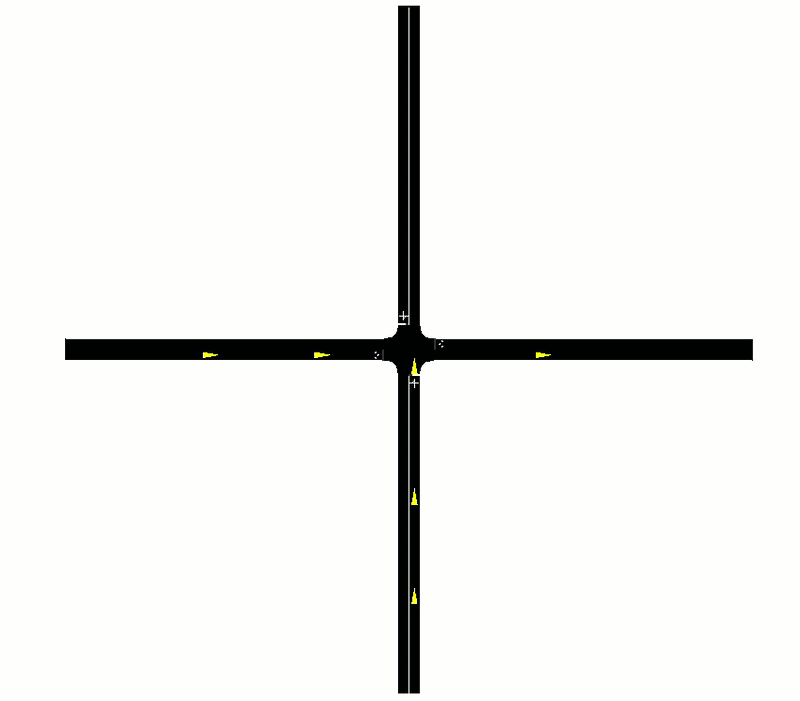

# 🚗 Intersection SUMO Simulation

This project simulates vehicle behavior at an intersection using the SUMO traffic simulator and custom Python logic for vehicle control, logging, and visualization.  

**code is kept private. For code access or questions, please contact me**
 

# ❗Project Significance 
This project explores a traffic‑light‑free intersection control strategy designed to reduce delays, minimize stop‑and‑go behavior, and improve overall traffic flow efficiency

# Implementation

- The vehicles are entering an intersection and are getting assigned a specific speed
- The speeds are assigned so the vehicles arrive at the intersection with a set time gap in between
- A P - controller is used to control the vehicle speeds

# Programs used

- Python 
- SUMO

## Python Libraries used

- traci
- numpy 
- pandas 
- matplotlib

# Results

## SUMO Simulation

The animation above shows the result of the traffic simulation. A time gap of 5 seconds was set. This means that the vehicles are entering the intersection with a 5 second time gap.  

 
The colors of the vehicles change according to their behavior:  
 
red: vehicle decelerates  
yellow: vehicle has constant speed  
green: vehicle accelerates  

 

## Diagram

 
As seen in the figure above, the vehicles decelerate and then drive at a constant speed. 
After passing the intersection, they accelerate again. The time gap is visible in the diagram as the interval when two consecutive vehicles begin to accelerate.
 
The figure also shows that with each new vehicle approaching the intersection, its speed must decrease even further in order to arrive as its designated time since each new vehicle must maintain the required time gap behind an increasing number of vehicles already in the queue.
